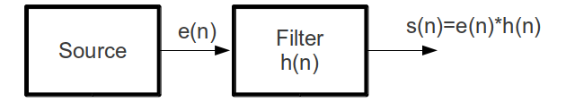
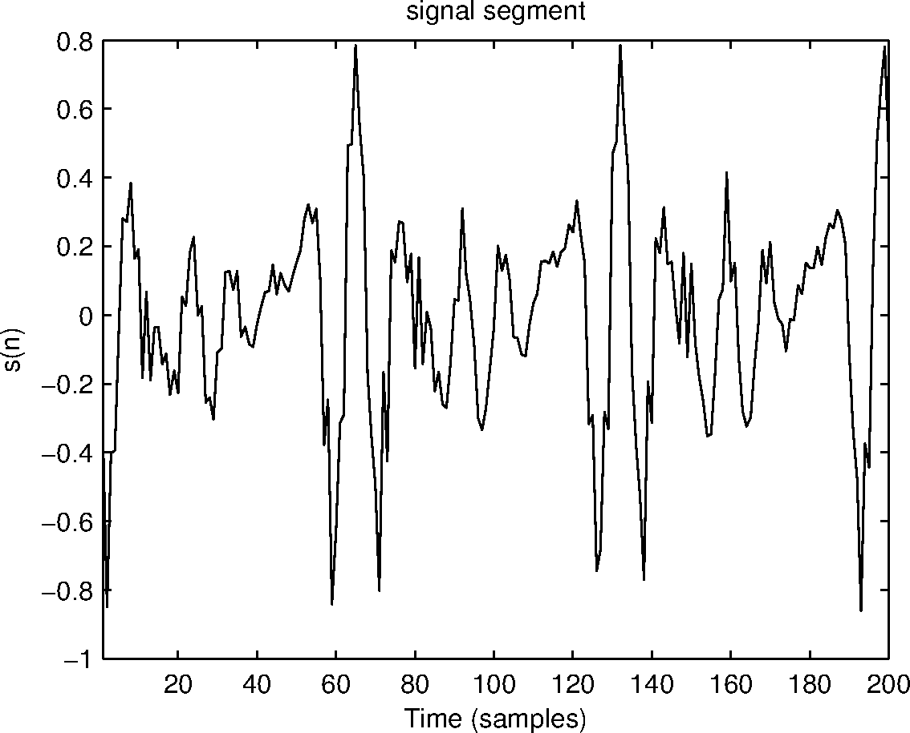
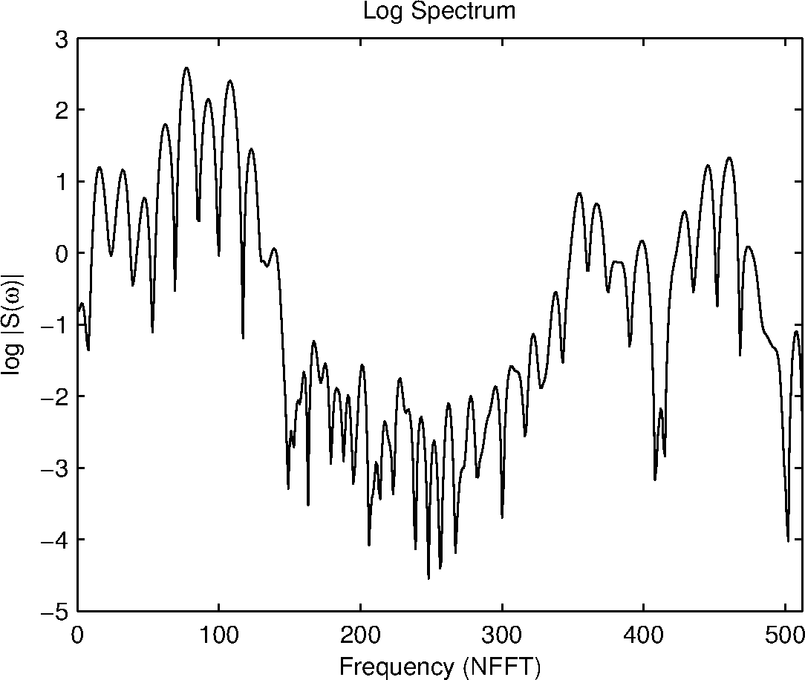
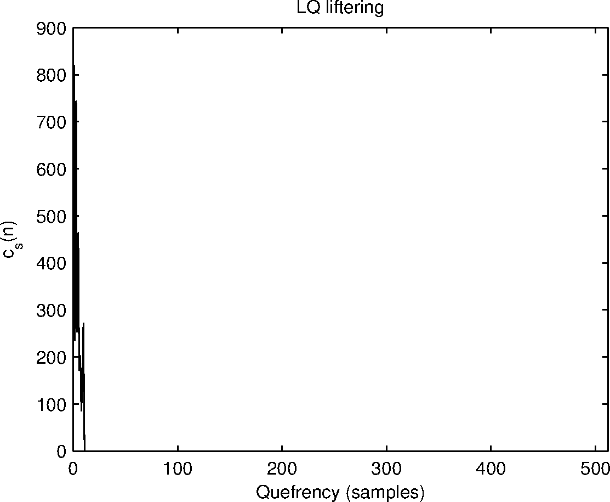
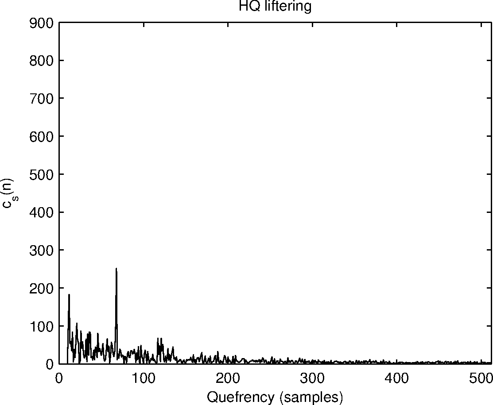

### The Short-time Cepstrum

In the source-filter model of speech processing (shown in Figure 1), speech is produced by exciting a time-varying filter. The excitation generated by the source may be either periodic (in the case of voiced sounds) or noise-like (in the case of unvoiced sounds). Thus the speech signal is produced by convolving the excitation signal by the response of the filter.

  
 

Figure 1: Source-filter model of speech production.

We know that convolution of two signals in the time domain is equivalent to multiplication in the spectral domain. Since in the speech signal, the source and filter are convolutionally combined, they cannot be separated by normal linear filtering techniques. To do so, one would in addition to the speech signal, need to know either the source or the filter. Short-time spectral analysis of speech signals will generally show the magnitude response of the filter overridden by pitch harmonics when the duration of the analysis window is more than a pitch period.

Homomorphic signal processing provides us with techniques that can separate the source and filter to some extent. It does so by processing the signal in the cepstral domain, which uses the logarithmic operator to get additivity among multiplicative components. The word 'cepstral' is derived from cepstrum which in turn is derived by reversing the order of the first four letters of the term spectrum. In the cepstral domain, the signal components are additive, easily allowing for the use of linear filtering techniques

To illustrate the process of computing the cepstrum, consider a speech signal \(s(n)\) produced by exciting a filter \(h(n)\) be \(e(n)\), i.e., $$ s(n)=h(n)*e(n). \qquad (1) $$ Let \(S(\omega)\), \(H(\omega)\) and \(E(\omega)\) be the Fourier transforms corresponding to \(s(n)\), \(h(n)\) and \(e(n)\) respectively. Then $$ S(\omega)=H(\omega)E(\omega). \qquad(2) $$

Since \(S(\omega)\) is complex, it can be represented as $$ S(\omega)=|S(\omega)|e^{j \theta (\omega)}. \qquad (3) $$ Application of the logarithmic operator yields $$ \log S(\omega)=\log |S(\omega)|+j\theta (\omega). \qquad (4) $$ The cepstrum can also be computed from the real part of \(\log S(\omega)\) in which case the cepstrum is referred to as the real cepstrum. Considering only the real part, \begin{eqnarray} \mbox{real} \{\log S(\omega)\} & = & \log |S(\omega)| \qquad(5) \end{eqnarray}

From Eq. 2 and Eq. 5, we get
\begin{eqnarray} log|S(\omega)| & = & \log |H(\omega) E(\omega)| \qquad(6) \\ & = & \log |H(\omega)| + \log|E(\omega)|. \qquad(7) \end{eqnarray}

Applying the Fourier transform (or the inverse Fourier transform), we obtain $$ c_S(n)=c_H(n) + c_E(n) \qquad(8) $$ where \(c_S(n)\), \(c_H(n)\) and \(c_E(n)\) are the Fourier transforms (or the inverse Fourier transforms) of \(\log |S(\omega)|\), \(\log |H(\omega)|\) and \(\log |E(\omega)|\) respectively and are the corresponding cepstral sequences. The dimension in the cepstrum domain is of time and is referred to as 'quefrency'. Linear filtering techniques can now be applied in the cepstrum domain and the inverse Fourier transform (or the Fourier transform) can be applied to obtain the corresponding spectrum.

  
 

Figure 2: Section of a speech signal for vowel /a/.

### Obtaining source and filter components using cepstral analysis

For a speech segment of duration 25 ms shown in Figure 2, the magnitude response and the corresponding real cepstrum are shown in Figure 3 (a) and 3 (b) respectively. The local peaks which correspond to harmonics (due to quasi periodic vocal folds vibrations) in Figure 3 (a) represent the high quefrency regions in the cepstrum shown in Figure 3 (b). The global peaks of the envelope of the magnitude spectrum (resonances of the vocal tract system) represent the low quefrency regions in the cepstrum. Note that the cepstrum shows a peak at around the time lag corresponding to the pitch period for segments of voiced speech.

As the cepstrum has the additive property, the resonances corresponding to the vocal tract system are obtained by liftering and applying Fourier transform on initial few samples of cepstrum. The low quefrency region of the cepstrum and its liftered spectrum are shown in Figure 4 (a) and 4 (b) respectively. It can be seen that the spectral characteristics corresponding to the filter (vocal-tract system) can be clearly observed. Similarly, Figure 5 shows the high quefrency liftered cepstrum with the corresponding spectrum. The spectrum shows the periodic structure that normally overrides the speech spectrum.

  
 

	
(a)
	
(b)
Figure 3: (a) Log spectrum, and corresponding (b) cepstrum of the segment shown in Figure 2.

	
(a)
	
(b)

  
 

Figure 4: (a) Low quefrency liftering of the cepstrum and the corresponding (b) liftered Log spectrum

	
(a)
	
(b)

  
 

Figure 5: (a) High quefrency liftering of the cepstrum and the corresponding (b) liftered Log spectrum

